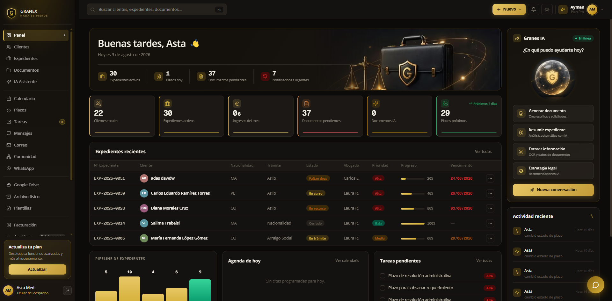
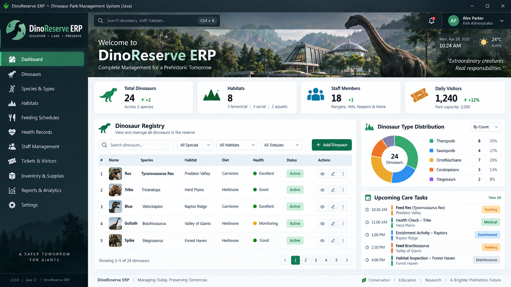

<h1 align="center">Ayman Bakhouza</h1>

  <strong>Data Analyst · Data Engineer · Full-Stack Developer</strong>

  Finanzas · Analítica de Datos · SaaS · Desarrollo Web · E-commerce

  
  
  

  

---

## 👨‍💻 Sobre mí

Graduado en **Economía y Gestión** por la Université Mohammed Premier (Oujda) y actualmente cursando **Desarrollo de Aplicaciones Web (DAW)** en Granada.

Mi perfil combina **economía, análisis de datos y desarrollo de software**, con especial interés en:

- Data Analytics
- Data Engineering
- Business Intelligence
- FinTech
- SaaS
- Desarrollo web full-stack
- E-commerce

Me interesa especialmente construir productos digitales y sistemas que conecten la parte técnica con necesidades reales de negocio.

**Idiomas:** Árabe (nativo) · Francés (avanzado) · Español (avanzado) · Inglés (intermedio)

---

## 🧰 Stack técnico

  

### Datos & BI
`Python` · `SQL` · `Pandas` · `NumPy` · `Power BI` · `Excel` · `Jupyter Notebook`

### Web & SaaS
`Next.js` · `React` · `TypeScript` · `JavaScript` · `Tailwind CSS` · `Supabase` · `PostgreSQL` · `Drizzle ORM`

### E-commerce
`Shopify` · `Liquid` · `JavaScript` · `CSS` · `GSAP` · `Shopify CLI`

### Herramientas
`Git` · `GitHub` · `Visual Studio Code` · `Vercel`

---

# 🚀 Proyectos destacados

## ⚖️ Granex Legal

Plataforma SaaS orientada a **abogados de extranjería en España**, diseñada para centralizar clientes, expedientes, documentos, plazos, automatizaciones y herramientas asistidas por IA.

**Stack:**  
`Next.js` · `TypeScript` · `React` · `Tailwind CSS` · `Supabase` · `PostgreSQL` · `Drizzle ORM` · `Vercel`

  

### Highlights

- Gestión de expedientes y clientes
- Arquitectura multi-tenant
- Roles y permisos
- Aislamiento de datos
- Gestión documental
- Calendario, plazos y recordatorios
- Herramientas asistidas por IA
- Internacionalización ES / FR / AR
- Auditoría y seguridad
- Entornos de staging y producción

---

## 🛍️ [Azra Luxury Kaftan Shop Project](https://github.com/AymanBakhouza/Azra-Luxury-Kaftan-Shop-Project)

Tienda online premium desarrollada para **AZRA**, una marca de caftanes de lujo, sobre **Shopify Online Store 2.0**.

El proyecto combina una experiencia editorial de moda con desarrollo personalizado de theme, storytelling de marca, experiencia responsive y animaciones avanzadas.

**Stack:**  
`Shopify` · `Liquid` · `JavaScript` · `CSS` · `GSAP` · `Shopify CLI`

  

### Highlights

- Tema Shopify personalizado
- Secciones Liquid desarrolladas a medida
- Diseño editorial para moda de lujo
- Páginas de producto y colección personalizadas
- Our Story
- The Atelier
- Journal / Blog
- Soporte bilingüe EN / ES
- Diseño responsive
- Animaciones con GSAP y ScrollTrigger
- Optimización de experiencia e-commerce

---

## 🦖 [DinoReserve ERP](https://github.com/AymanBakhouza/DinoReserve-ERP)

Sistema ERP para la gestión integral de un parque de dinosaurios, desarrollado como aplicación Java orientada a la administración de especies, hábitats, alimentación, salud, personal, visitantes y operaciones.

**Stack:**  
`Java` · `SQL` · `MVC`

  

### Funcionalidades

- Registro y gestión de dinosaurios
- Gestión de especies y tipos
- Hábitats
- Calendarios de alimentación
- Historiales de salud
- Gestión de personal
- Tickets y visitantes
- Inventario y suministros
- Reportes y analítica
- Arquitectura MVC
- Persistencia de datos con SQL

---

## 🎓 Formación

- **Desarrollo de Aplicaciones Web (DAW)** — Granada *(en curso)*
- **Licenciatura en Economía y Gestión** — Université Mohammed Premier, Oujda

---

## 🌍 Áreas de interés

`Data Analytics` · `Data Engineering` · `Business Intelligence` · `FinTech` · `SaaS` · `Automatización` · `E-commerce` · `Full-Stack Development`

---

## 📬 Contacto

  <strong>
    Abierto a oportunidades profesionales, prácticas y proyectos en Data, BI, Data Engineering, FinTech y Desarrollo Web.
  </strong>

  <a href="mailto:bk.ayman04@gmail.com">Email</a>
  ·
  <a href="https://www.linkedin.com/in/aymanbakhouza/">LinkedIn</a>
  ·
  <a href="https://github.com/AymanBakhouza">GitHub</a>

